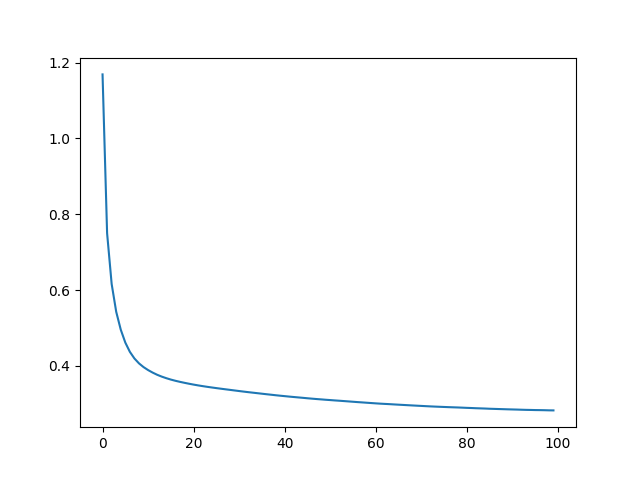

# Regression Model
Regression Model in PyTorch

In the training loop, each epoch is to run the forward and backward steps with the training set a few times to optimize the model weights, and at the end of the epoch, the model is evaluated using the test set. It is the MSE from the test set that is remembered in the list history. It is also the metric to evaluate a model, which the best one is stored in the variable best_weights.

In below, you can show the MSE and RMSE, and plot the history of MSE. It should be decreasing with the epochs.

```python
print("RMSE: %.2f" % np.sqrt(best_mse))
plt.plot(history)
plt.show()
```

MSE: 0.47  
RMSE: 0.68

#The MSE graph would like the following.


